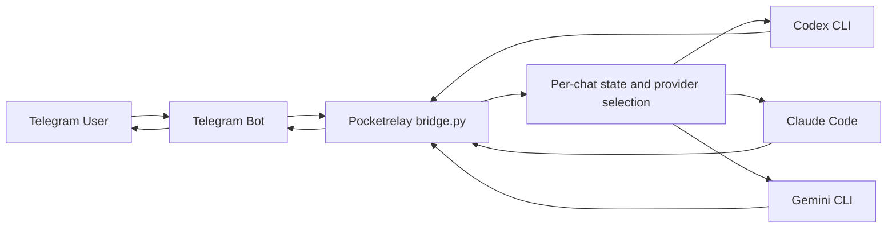

# Pocketrelay

[English README](README.md)

Pocketrelay は、Codex CLI、Claude Code、Gemini CLI などのローカル AI コーディング CLI を、スマホ経由で利用しながら開発を進めるための軽量ブリッジです。

Raspberry Pi 専用ではありません。Raspberry Pi は常時起動しておく小型ホストの一例にすぎず、Pocketrelay は CLI ツール、リポジトリ、認証状態がすでに揃っている任意の自己管理マシンで使うことを想定しています。

## 名前の意味

`Pocketrelay` は「自分のローカル開発環境をポケットまで中継する」という意味です。席を離れていても、スマホで Telegram を開けば、使い慣れた自分のマシンと CLI 環境をそのまま使える、という考え方に基づいています。

## 何がうれしいか

Pocketrelay は単なる API ラッパーではありません。ホストされた別サービスに合わせてワークフローを組み直すのではなく、手元のローカル環境をそのまま活かせる点に価値があります。

- すでにマシン上にある CLI のログイン状態をそのまま使える
- いつも使っているローカルのツール、リポジトリ、shell 環境、ファイルをそのまま活用できる
- 机に向かわなくても、休憩中にスマホからプロンプトを投げられる
- 自分のマシンに到達するためだけに、別の API サービス層を立てなくてよい
- 同じ Telegram の窓口の裏側で、Codex、Claude、Gemini、独自 CLI を切り替えられる

## 何をするものか

- Telegram のメッセージを Bot 経由で受け取ります
- 許可した 1 つの Telegram ユーザー名だけにアクセスを制限します
- 各リクエストごとにローカルの AI CLI を実行します
- `codex`、`claude`、`gemini` の組み込みプリセットがあります
- `/provider codex` のような Telegram コマンドで、チャットごとに provider を切り替えられます
- プリセットで足りない場合は、完全なカスタムコマンドテンプレートも使えます
- チャットごとに短い会話履歴をローカル保存します

## 仕組み

Pocketrelay 自体は OpenAI、Anthropic、Google の API を直接呼びません。代わりに、そのマシンに入っている CLI のログイン状態とローカルでの動作を再利用し、Telegram のメッセージごとに CLI を呼び出します。



## 対応プロバイダ

- `codex` — `codex exec ...` を実行し、出力ファイルから最終返答を読みます。
- `claude` — `claude -p ...` を実行し、stdout から返答を読みます。
- `gemini` — `gemini -p ... --output-format json` を実行し、`response` フィールドを読みます。

Anthropic は `claude -p` と `--output-format` を、Google は Gemini CLI の headless mode における `-p` と `--output-format json` を公式ドキュメントで案内しています。

- Claude Code CLI リファレンス: https://code.claude.com/docs/en/cli-reference
- Gemini CLI headless mode: https://google-gemini.github.io/gemini-cli/docs/cli/headless.html

## 設定

最小設定例:

```json
{
  "telegram_bot_token": "REPLACE_WITH_BOT_TOKEN",
  "allowed_username": "@your_username",
  "provider": "codex",
  "model": "gpt-5.4",
  "cli_command_template": [
    "/home/your_user/.nvm/versions/node/v24.15.0/bin/codex",
    "exec",
    "--skip-git-repo-check",
    "--ephemeral",
    "-C",
    "{workdir}",
    "-m",
    "{model}",
    "-o",
    "{output_path}",
    "{prompt}"
  ],
  "workdir": "/home/your_user",
  "max_history": 12,
  "telegram_timeout_seconds": 25,
  "cli_timeout_seconds": 180,
  "system_prompt": "You are Codex, a pragmatic coding assistant running through a Telegram bridge on a Raspberry Pi.\nKeep answers concise and actionable. Assume the user may ask about the local machine, software setup, shell commands,\nGitHub workflows, and coding tasks. You are replying inside Telegram, so avoid long answers and keep them scannable.\nIf you are unsure, state uncertainty directly."
}
```

主なキー:

- `provider`: `codex`、`claude`、`gemini` のいずれか。チャットごとの `/provider` 上書きがない場合の既定値です
- `model`: 選択した CLI にそのまま渡されます
- `workdir`: CLI 起動時の作業ディレクトリです
- `cli_timeout_seconds`: ローカル CLI プロセスのタイムアウトです
- `system_prompt`: 内蔵のシステムプロンプトを差し替える任意設定です
- `env`: 追加の環境変数を渡す任意オブジェクトです
- `cli_command_template`: 完全なカスタムコマンドテンプレートを指定する任意設定です
- `cli_response_mode`: 出力の読み方を上書きする任意設定です。`output_file`、`stdout`、`json_stdout`
- `cli_response_key`: `json_stdout` 利用時の JSON キーを上書きする任意設定です

`cli_command_template` で使えるプレースホルダ:

- `{prompt}`
- `{model}`
- `{workdir}`
- `{output_path}`

カスタムテンプレート例:

```json
{
  "provider": "custom-tool",
  "cli_label": "My Local Agent",
  "cli_command_template": [
    "/usr/local/bin/my-agent",
    "--model",
    "{model}",
    "--prompt",
    "{prompt}"
  ],
  "cli_response_mode": "stdout"
}
```

Claude Code をバイナリの絶対パス付きで明示する例:

```json
{
  "provider": "claude",
  "model": "sonnet",
  "cli_command_template": [
    "/home/your_user/.nvm/versions/node/v24.15.0/bin/claude",
    "-p",
    "--output-format",
    "text",
    "--model",
    "{model}",
    "{prompt}"
  ],
  "cli_response_mode": "stdout"
}
```

## セットアップ

1. リポジトリをクローンします。
2. 設定テンプレートをコピーします。
3. Bot トークンと許可する Telegram ユーザー名を入力します。
4. `provider`、`model`、`workdir` を設定します。
5. 選んだ CLI が同じマシンにインストールされ、認証済みであることを確認します。
6. まず 1 回実行して動作確認します。

```bash
cp config.example.json config.json
python3 bridge.py --once
```

継続実行する場合:

```bash
python3 bridge.py
```

## 環境メモ

- Raspberry Pi は利用例のひとつであり、必須ではありません
- Python 3 と対象 CLI が入っている Linux マシンを主な利用環境として想定しています
- CLI が同様に動作するなら、他の自己管理環境でも同じ構成で利用できます

## コマンド

- `/start`
- `/help`
- `/reset`
- `/status`
- `/provider`
- `/provider codex`
- `/provider claude`
- `/provider gemini`
- `/provider reset`

`/status` はそのチャットの現在 provider、既定 provider、設定済みコマンド、バイナリの有無、readiness 診断、作業ディレクトリを表示します。

引数なしの `/provider` は、現在の provider と利用可能な候補を表示します。

`/provider codex` や `/provider claude` は現在のチャットだけを切り替えるため、ある CLI が利用制限に当たったときの退避先として使えます。

`/provider reset` は、そのチャットを `config.json` の既定 provider に戻します。

provider の依存が不足している場合は、曖昧な subprocess エラーではなく、不足内容を明示して返します。

## systemd ユーザーサービス

`systemd/pocketrelay.service` にサービスファイルの例があります。サービスを有効化する前に、リポジトリのパスを自分の環境に合わせて更新してください。

```bash
mkdir -p ~/.config/systemd/user
cp systemd/pocketrelay.service ~/.config/systemd/user/
systemctl --user daemon-reload
systemctl --user enable --now pocketrelay.service
```

## Node バージョン管理（nvm）

nvm を使っている場合、Node.js バージョンごとに独立した `bin` ディレクトリがあります。`codex` と `claude` は、systemd サービスの PATH が指すバージョンにインストールされている必要があります。

サービスファイルには PATH を明示的に記載します。例:

```ini
Environment=PATH=/home/your_user/.nvm/versions/node/v24.15.0/bin:/usr/local/sbin:/usr/local/bin:/usr/sbin:/usr/bin:/sbin:/bin
```

その version の bin に CLI が入っていなければ、対話 shell では動いていてもサービスからは見つかりません。

**固定バージョンに両方の CLI を入れ直す場合:**

```bash
nvm use v24.15.0
npm install -g @openai/codex
npm install -g @anthropic-ai/claude-code
```

**nvm のデフォルトバージョンを変更した場合は、新しいバージョンに両方の CLI を再インストールし、サービスファイルの PATH 行も合わせて更新してください。**

```bash
# デフォルトバージョン変更
nvm alias default v24.15.0

# サービス PATH を更新してリロード
systemctl --user daemon-reload
systemctl --user restart pocketrelay.service
```

サービスが実際に解決するバイナリを確認するには、Telegram で `/status` を実行してください。`cli_binary_path` と `cli_readiness` フィールドが、サービス側の PATH で見える状態を反映しています。

## 制限事項

- 文脈は、最近のチャット履歴を各リクエストに再投入することで近似しています
- provider 切替はチャット単位ですが、model や追加環境変数は依然として `config.json` ベースのグローバル設定です
- CLI の挙動は将来変わりうるため、上流のフラグ変更に応じてプリセット更新が必要になる場合があります
- アクセス制御はユーザー名ベースで、単純ですが最も強固な方法ではありません
- このプロジェクトは、自分で管理しているマシンを前提としており、堅牢化されたマルチテナントサービスではありません

## ファイル構成

- `bridge.py`: メインのブリッジ処理
- `config.example.json`: 設定ファイルのテンプレート
- `systemd/pocketrelay.service`: systemd のユーザーサービス例
- `state.json`: 実行時にローカル作成される状態ファイル
- `bridge.log`: 実行時にローカル作成されるログファイル
