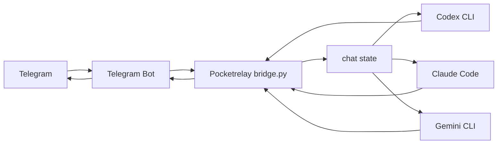

# Pocketrelay

[English README](README.md)

Pocketrelay は、Telegram から自分のマシン上の AI コーディング CLI を呼び出すための軽量ブリッジです。Codex CLI、Claude Code、Gemini CLI など、すでにローカルで使っている CLI とログイン状態をそのまま使います。

Raspberry Pi 専用ではありません。Raspberry Pi は常時起動できる小型ホストの一例です。Linux マシン、ミニ PC、自宅サーバーなど、Python 3 と対象 CLI が動く自己管理マシンで使うことを想定しています。

## 何がうれしいか

Pocketrelay の価値は、スマホからでも「いつもの開発環境」に届くことです。

- Telegram だけでローカルの Codex / Claude / Gemini に依頼できる
- ローカルにあるリポジトリ、設定、認証済み CLI、shell 環境をそのまま使える
- 外出中や離席中でも、軽い調査・修正・Git 操作を進められる
- AI API を直接組み込む別サービスを作らなくても、自分のマシンを中継できる
- provider をチャットから切り替えられるので、用途や制限に応じて逃げ道を作れる
- Codex ではセッションを再開できるため、作業の続きを Telegram から頼みやすい

## できること

- Telegram Bot のメッセージを受け取る
- 許可した 1 つの Telegram ユーザー名だけに応答する
- `codex`、`claude`、`gemini` の provider を切り替える
- Codex CLI の永続セッションを保存・再開する
- Codex の承認が必要そうな失敗をキューに入れ、Telegram から再実行する
- CLI 実行中に開始・継続・stdout 由来の進捗を Telegram に送る
- カスタムコマンドテンプレートで任意の CLI を呼び出す

## 仕組み

Pocketrelay 自体は OpenAI、Anthropic、Google の API を直接呼びません。Telegram の入力を受け取り、同じマシンに入っている CLI を subprocess として実行し、結果を Telegram に返します。


```mermaid
flowchart LR
    U[Telegram] --> B[Telegram Bot]
    B --> P[Pocketrelay bridge.py]
    P --> S[chat state]
    S --> C1[Codex CLI]
    S --> C2[Claude Code]
    S --> C3[Gemini CLI]
    C1 --> P
    C2 --> P
    C3 --> P
    P --> B
    B --> U
```

## 対応 provider

| provider | 実行方法 | 返答の読み取り |
| --- | --- | --- |
| `codex` | `codex exec ...` | `-o` の出力ファイル |
| `claude` | `claude -p ... --output-format text` | stdout |
| `gemini` | `gemini -p ... --output-format json` | JSON の `response` |

`provider` は既定値を `config.json` で決められます。Telegram 側では `/provider codex` のようにチャット単位で切り替えられます。

## セットアップ

1. Telegram の BotFather で Bot を作成し、Bot token を取得します。
2. このリポジトリを、常時起動したいマシンに置きます。
3. 使いたい CLI、例: Codex CLI、Claude Code、Gemini CLI、をそのマシンにインストールしてログインします。
4. 設定ファイルを作ります。

```bash
cp config.example.json config.json
```

5. `config.json` の `telegram_bot_token`、`allowed_username`、`provider`、`model`、`workdir` を編集します。
6. まず 1 回だけ実行して動作確認します。

```bash
python3 bridge.py --once
```

7. 問題なければ常駐実行します。

```bash
python3 bridge.py
```

## 設定例

```json
{
  "telegram_bot_token": "REPLACE_WITH_BOT_TOKEN",
  "allowed_username": "@your_username",
  "provider": "codex",
  "model": "gpt-5.4",
  "cli_command_template": [
    "/home/your_user/.nvm/versions/node/v24.15.0/bin/codex",
    "exec",
    "--skip-git-repo-check",
    "-C",
    "{workdir}",
    "-m",
    "{model}",
    "-o",
    "{output_path}",
    "{prompt}"
  ],
  "workdir": "/home/your_user",
  "codex_sessions": true,
  "codex_approval_mode": "queue",
  "telegram_timeout_seconds": 25,
  "cli_timeout_seconds": 600,
  "processing_message": "受け付けました。処理中です。",
  "progress_updates": true,
  "progress_interval_seconds": 30,
  "progress_output_interval_seconds": 15,
  "progress_line_max_chars": 240,
  "system_prompt": "You are Codex, a pragmatic coding assistant running through a Telegram bridge.\nKeep answers concise and actionable."
}
```

主な項目:

- `telegram_bot_token`: Telegram Bot token
- `allowed_username`: 応答を許可する Telegram ユーザー名
- `provider`: 既定 provider。`codex`、`claude`、`gemini`
- `model`: CLI に渡すモデル名
- `workdir`: CLI を起動する作業ディレクトリ
- `codex_sessions`: Codex CLI のセッションを保存・再開するか
- `codex_approval_mode`: Codex の実行モード。`queue`、`safe`、`read-only`、`full-auto`、`dangerous`
- `cli_timeout_seconds`: CLI 実行のタイムアウト
- `processing_message`: CLI 起動前に Telegram へ送る受付メッセージ
- `progress_updates`: 実行中の進捗通知を有効にするか
- `progress_interval_seconds`: stdout がない時の継続通知間隔
- `progress_output_interval_seconds`: stdout 由来の進捗通知の最短間隔
- `progress_line_max_chars`: 進捗として送る stdout 行の最大文字数
- `system_prompt`: 初回プロンプトに付けるシステム指示
- `env`: CLI に追加で渡す環境変数
- `cli_command_template`: provider の実行コマンドを上書きするテンプレート
- `cli_response_mode`: 返答の読み取り方法。`output_file`、`stdout`、`json_stdout`
- `cli_response_key`: `json_stdout` で読む JSON キー

`cli_command_template` では次のプレースホルダが使えます。

- `{prompt}`
- `{model}`
- `{workdir}`
- `{output_path}`

## Telegram コマンド

### 基本

- `/start`: 接続確認
- `/help`: 使えるコマンドを表示
- `/status`: 現在の provider、CLI readiness、作業ディレクトリ、進捗設定などを表示
- `/reset`: 会話履歴と保存済みセッションをリセット

### provider 切り替え

- `/provider`: 現在の provider と候補を表示
- `/provider codex`: このチャットを Codex に切り替え
- `/provider claude`: このチャットを Claude に切り替え
- `/provider gemini`: このチャットを Gemini に切り替え
- `/provider reset`: `config.json` の既定 provider に戻す

### Codex セッション

- `/session`: 現在のセッション状態を表示
- `/session status`: `/session` と同じ
- `/session new`: 現在 provider の保存済みセッションを消し、次回から新規開始
- `/session reset`: `/session new` と同じ

`codex_sessions` が `true` の場合、Pocketrelay は Codex CLI の session id を `state.json` に保存し、次回以降 `codex exec resume` で同じ作業文脈を再開します。

### Codex 承認モード

- `/approval`: 現在の承認モードと保留中キューを表示
- `/approval queue`: 安全側で実行し、承認が必要そうな失敗をキューに入れる
- `/approval safe`: 追加の承認フラグなしで実行
- `/approval read-only`: read-only sandbox で実行
- `/approval full-auto`: `--full-auto` で実行
- `/approval dangerous`: sandbox と承認を迂回して実行
- `/approval reset`: `config.json` の既定値に戻す
- `/approve <approval_id> full-auto`: キュー済み依頼を `full-auto` で再実行
- `/approve <approval_id> dangerous`: キュー済み依頼を `dangerous` で再実行
- `/deny <approval_id>`: キュー済み依頼を取り消す

`dangerous` はローカルマシンへの影響が大きいモードです。必要な 1 回だけ `/approve` で使う運用を推奨します。

## 進捗通知

通常メッセージを送ると、Pocketrelay はまず `processing_message` を返します。その後、CLI を起動したこと、CLI stdout の一部、無出力時の継続通知を Telegram に送ります。

例:

```text
受け付けました。処理中です。
Codex CLI を起動しました。処理を開始しています。
進捗: ...
処理継続中です。経過 30 秒。
```

細かすぎる場合は `progress_updates` を `false` にするか、`progress_interval_seconds` と `progress_output_interval_seconds` を大きくしてください。

## systemd ユーザーサービス

常駐させる場合は `systemd/pocketrelay.service` を自分の環境に合わせて編集してから配置します。

```bash
mkdir -p ~/.config/systemd/user
cp systemd/pocketrelay.service ~/.config/systemd/user/
systemctl --user daemon-reload
systemctl --user enable --now pocketrelay.service
```

状態確認:

```bash
systemctl --user status pocketrelay.service
```

nvm で Node.js CLI を入れている場合、systemd から見える `PATH` に `codex`、`claude`、`gemini` が入っている必要があります。サービスファイルに `Environment=PATH=...` を明示してください。

## ローカルファイル

- `config.json`: ローカル設定。Bot token を含むため Git 管理しない
- `state.json`: update id、チャット設定、Codex session id、承認キュー
- `bridge.log`: 実行ログ
- `.last_message_*.txt`: CLI 出力の一時ファイル。通常は実行後に削除される

## セキュリティ上の注意

- `config.json` の Bot token を公開しないでください
- `allowed_username` は簡易的なアクセス制御です。公開サービス用途ではありません
- このプロジェクトは自分用の自己管理マシンで使う前提です
- `dangerous` モードはローカルファイルやコマンド実行に大きく影響します
- Telegram Bot を他人が参加するグループに入れる運用は避けてください

## トラブルシュート

### Telegram から反応がない

- `python3 bridge.py --once` で例外が出ないか確認する
- Bot token が正しいか確認する
- `allowed_username` が `@` 付きまたはなしで正しく設定されているか確認する
- 別プロセスが同じ Bot token で `getUpdates` していないか確認する

### CLI が見つからない

- `/status` の `cli_binary` と `cli_readiness` を確認する
- systemd 利用時はサービスの `PATH` を確認する
- nvm を使っている場合、固定 Node.js バージョンの `bin` に CLI が入っているか確認する

### 実行が途中で止まる

- `/approval status` で承認キューを見る
- 必要なら `/approve <id> full-auto` で一度だけ再実行する
- `cli_timeout_seconds` が短すぎないか確認する

