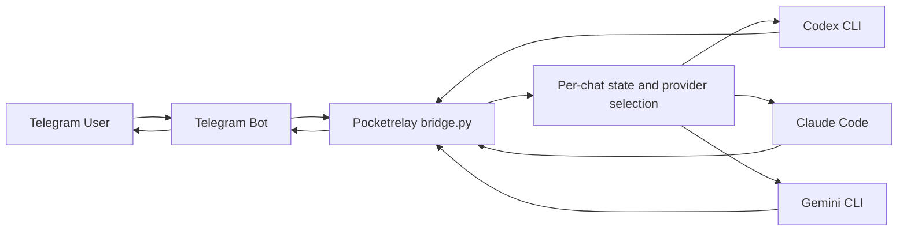

# Pocketrelay

English comes first in this README, and each section is followed by Japanese.  
この README は英語が先にあり、各セクションのあとに日本語が続きます。

Pocketrelay is a lightweight way to work through local AI coding CLIs such as Codex CLI, Claude Code, and Gemini CLI from your phone.  
Pocketrelay は、Codex CLI、Claude Code、Gemini CLI などのローカル AI コーディング CLI を、スマホ経由で利用しながら開発を進めるための軽量ブリッジです。

It is not specific to Raspberry Pi. A Raspberry Pi is just one example of a small always-on host; Pocketrelay is meant for any user-managed machine where your CLI tools, repositories, and auth state already live.  
Raspberry Pi 専用ではありません。Raspberry Pi は常時起動しておく小型ホストの一例にすぎず、Pocketrelay は CLI ツール、リポジトリ、認証状態がすでに揃っている任意の自己管理マシンで使うことを想定しています。

## What Pocketrelay Means / 名前の意味

`Pocketrelay` means "relay my local development environment to my pocket." The idea is simple: even when you are away from your desk, you can open Telegram on your phone and keep using the machine and CLI setup you already trust.  
`Pocketrelay` は「自分のローカル開発環境をポケットまで中継する」という意味です。席を離れていても、スマホで Telegram を開けば、使い慣れた自分のマシンと CLI 環境をそのまま使える、という考え方に基づいています。

## Why It Exists / 何がうれしいか

Pocketrelay is not just another API wrapper. Its value is that it reuses your existing local setup instead of asking you to rebuild your workflow around a hosted service.  
Pocketrelay は単なる API ラッパーではありません。ホストされた別サービスに合わせてワークフローを組み直すのではなく、手元のローカル環境をそのまま活かせる点に価値があります。

Why that helps:

- Reuse the CLI login state you already have on your machine  
  すでにマシン上にある CLI のログイン状態をそのまま使える
- Keep using the same local tools, repos, shell environment, and files you already work with  
  いつも使っているローカルのツール、リポジトリ、shell 環境、ファイルをそのまま活用できる
- Send a prompt from your phone during a break instead of sitting at your desk  
  机に向かわなくても、休憩中にスマホからプロンプトを投げられる
- Avoid standing up a separate API service just to reach your own machine  
  自分のマシンに到達するためだけに、別の API サービス層を立てなくてよい
- Switch between Codex, Claude, Gemini, or a custom CLI behind the same Telegram entry point  
  同じ Telegram の窓口の裏側で、Codex、Claude、Gemini、独自 CLI を切り替えられる

## What It Does / 何をするものか

- Receives Telegram messages through a bot  
  Telegram のメッセージを Bot 経由で受け取ります
- Restricts access to one allowed Telegram username  
  許可した 1 つの Telegram ユーザー名だけにアクセスを制限します
- Invokes a local AI CLI for each request  
  各リクエストごとにローカルの AI CLI を実行します
- Supports built-in presets for `codex`, `claude`, and `gemini`  
  `codex`、`claude`、`gemini` の組み込みプリセットがあります
- Can switch provider per chat through Telegram commands such as `/provider codex`  
  `/provider codex` のような Telegram コマンドで、チャットごとに provider を切り替えられます
- Allows a fully custom command template when presets are not enough  
  プリセットで足りない場合は、完全なカスタムコマンドテンプレートも使えます
- Stores a short local conversation history per chat  
  チャットごとに短い会話履歴をローカル保存します

## How It Works / 仕組み

Pocketrelay does not call OpenAI, Anthropic, or Google APIs directly. Instead, it reuses the login state and local behavior of a CLI that is already installed on your machine, then invokes that CLI for each Telegram message.  
Pocketrelay 自体は OpenAI、Anthropic、Google の API を直接呼びません。代わりに、そのマシンに入っている CLI のログイン状態とローカルでの動作を再利用し、Telegram のメッセージごとに CLI を呼び出します。



## Supported Providers / 対応プロバイダ

- `codex`  
  Runs `codex exec ...` and reads the final answer from the output file.
- `claude`  
  Runs `claude -p ...` and reads the answer from stdout.
- `gemini`  
  Runs `gemini -p ... --output-format json` and reads the `response` field.

`codex`  
`codex exec ...` を実行し、出力ファイルから最終返答を読みます。

`claude`  
`claude -p ...` を実行し、stdout から返答を読みます。

`gemini`  
`gemini -p ... --output-format json` を実行し、`response` フィールドを読みます。

Anthropic documents `claude -p` and `--output-format`; Google documents Gemini CLI headless mode with `-p` and `--output-format json`.  
Anthropic は `claude -p` と `--output-format` を、Google は Gemini CLI の headless mode における `-p` と `--output-format json` を公式ドキュメントで案内しています。

- Claude Code CLI reference: https://code.claude.com/docs/en/cli-reference
- Gemini CLI headless mode: https://google-gemini.github.io/gemini-cli/docs/cli/headless.html

## Configuration / 設定

Minimal example:

```json
{
  "telegram_bot_token": "REPLACE_WITH_BOT_TOKEN",
  "allowed_username": "@your_username",
  "provider": "codex",
  "model": "gpt-5.4",
  "workdir": "/home/your_user",
  "max_history": 12,
  "telegram_timeout_seconds": 25,
  "cli_timeout_seconds": 180
}
```

最小設定例:

```json
{
  "telegram_bot_token": "REPLACE_WITH_BOT_TOKEN",
  "allowed_username": "@your_username",
  "provider": "codex",
  "model": "gpt-5.4",
  "workdir": "/home/your_user",
  "max_history": 12,
  "telegram_timeout_seconds": 25,
  "cli_timeout_seconds": 180
}
```

Important keys:

- `provider`: one of `codex`, `claude`, `gemini`
  The default provider used unless a chat overrides it with `/provider`
- `model`: passed through to the selected CLI
- `workdir`: working directory used when launching the CLI
- `cli_timeout_seconds`: timeout for the local CLI process
- `system_prompt`: optional replacement for the built-in system prompt
- `env`: optional object of extra environment variables
- `cli_command_template`: optional string or string array for a fully custom command template
- `cli_response_mode`: optional override for how output is read: `output_file`, `stdout`, or `json_stdout`
- `cli_response_key`: optional JSON key when `cli_response_mode` is `json_stdout`

主なキー:

- `provider`: `codex`、`claude`、`gemini` のいずれか
  チャットごとの `/provider` 上書きがない場合の既定値です
- `model`: 選択した CLI にそのまま渡されます
- `workdir`: CLI 起動時の作業ディレクトリです
- `cli_timeout_seconds`: ローカル CLI プロセスのタイムアウトです
- `system_prompt`: 内蔵のシステムプロンプトを差し替える任意設定です
- `env`: 追加の環境変数を渡す任意オブジェクトです
- `cli_command_template`: 完全なカスタムコマンドテンプレートを指定する任意設定です
- `cli_response_mode`: 出力の読み方を上書きする任意設定です。`output_file`、`stdout`、`json_stdout`
- `cli_response_key`: `json_stdout` 利用時の JSON キーを上書きする任意設定です

Available placeholders inside `cli_command_template`:

- `{prompt}`
- `{model}`
- `{workdir}`
- `{output_path}`

`cli_command_template` で使えるプレースホルダ:

- `{prompt}`
- `{model}`
- `{workdir}`
- `{output_path}`

Example custom template:

```json
{
  "provider": "custom-tool",
  "cli_label": "My Local Agent",
  "cli_command_template": [
    "/usr/local/bin/my-agent",
    "--model",
    "{model}",
    "--prompt",
    "{prompt}"
  ],
  "cli_response_mode": "stdout"
}
```

カスタムテンプレート例:

```json
{
  "provider": "custom-tool",
  "cli_label": "My Local Agent",
  "cli_command_template": [
    "/usr/local/bin/my-agent",
    "--model",
    "{model}",
    "--prompt",
    "{prompt}"
  ],
  "cli_response_mode": "stdout"
}
```

## Setup / セットアップ

1. Clone the repository.  
   リポジトリをクローンします。
2. Copy the config template.  
   設定テンプレートをコピーします。
3. Fill in your bot token and allowed Telegram username.  
   Bot トークンと許可する Telegram ユーザー名を入力します。
4. Set `provider`, `model`, and `workdir`.  
   `provider`、`model`、`workdir` を設定します。
5. Make sure the selected CLI is installed and authenticated on the same machine.  
   選んだ CLI が同じマシンにインストールされ、認証済みであることを確認します。
6. Run once to verify it works.  
   まず 1 回実行して動作確認します。

```bash
cp config.example.json config.json
python3 bridge.py --once
```

To run continuously:

```bash
python3 bridge.py
```

継続実行する場合:

```bash
python3 bridge.py
```

## Environment Notes / 環境メモ

- A Raspberry Pi is a valid example host, but not a requirement  
  Raspberry Pi は利用例のひとつであり、必須ではありません
- The main intended environment is a Linux machine with Python 3 and your target CLI already installed  
  Python 3 と対象 CLI が入っている Linux マシンを主な利用環境として想定しています
- The same design can work on other user-managed environments if the CLI behaves the same way there  
  CLI が同様に動作するなら、他の自己管理環境でも同じ構成で利用できます

## Commands / コマンド

- `/start`
- `/help`
- `/reset`
- `/status`
- `/provider`
- `/provider codex`
- `/provider claude`
- `/provider gemini`
- `/provider reset`

`/status` shows the current provider for that chat, the default provider, configured command, binary availability, readiness diagnostics, and working directory.  
`/status` はそのチャットの現在 provider、既定 provider、設定済みコマンド、バイナリの有無、readiness 診断、作業ディレクトリを表示します。

`/provider` without an argument shows the current provider and available choices.  
引数なしの `/provider` は、現在の provider と利用可能な候補を表示します。

`/provider codex` or `/provider claude` switches only the current chat, which is useful when one CLI hits rate limits or usage caps.  
`/provider codex` や `/provider claude` は現在のチャットだけを切り替えるため、ある CLI が利用制限に当たったときの退避先として使えます。

`/provider reset` returns the chat to the default provider from `config.json`.  
`/provider reset` は、そのチャットを `config.json` の既定 provider に戻します。

When a provider is missing dependencies, Pocketrelay reports that explicitly instead of failing with a vague subprocess error.  
provider の依存が不足している場合は、曖昧な subprocess エラーではなく、不足内容を明示して返します。

## systemd User Service / systemd ユーザーサービス

An example service file is included at `systemd/pocketrelay.service`.  
`systemd/pocketrelay.service` にサービスファイルの例があります。

Update the repository path before enabling the service.  
サービスを有効化する前に、リポジトリのパスを自分の環境に合わせて更新してください。

```bash
mkdir -p ~/.config/systemd/user
cp systemd/pocketrelay.service ~/.config/systemd/user/
systemctl --user daemon-reload
systemctl --user enable --now pocketrelay.service
```

## Limitations / 制限事項

- This bridge approximates context by replaying recent chat history into each request  
  文脈は、最近のチャット履歴を各リクエストに再投入することで近似しています
- Provider switching is chat-scoped, but model and extra environment variables are still shared globally through `config.json`  
  provider 切替はチャット単位ですが、model や追加環境変数は依然として `config.json` ベースのグローバル設定です
- CLI behavior can change over time, so presets may need updates if upstream flags change  
  CLI の挙動は将来変わりうるため、上流のフラグ変更に応じてプリセット更新が必要になる場合があります
- Access control is username-based, which is simple but not the strongest option  
  アクセス制御はユーザー名ベースで、単純ですが最も強固な方法ではありません
- The project assumes you are running it on a machine you already manage, not as a hardened multi-tenant service  
  このプロジェクトは、自分で管理しているマシンを前提としており、堅牢化されたマルチテナントサービスではありません

## Files / ファイル構成

- `bridge.py`: main bridge process  
  メインのブリッジ処理
- `config.example.json`: configuration template  
  設定ファイルのテンプレート
- `systemd/pocketrelay.service`: example user service  
  `systemd` のユーザーサービス例
- `state.json`: runtime state file, created locally  
  実行時にローカル作成される状態ファイル
- `bridge.log`: runtime log file, created locally  
  実行時にローカル作成されるログファイル
