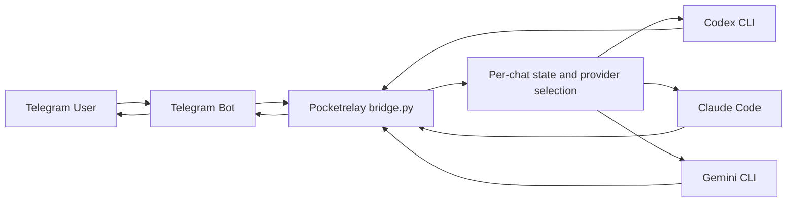

# Pocketrelay

[日本語版はこちら](README.ja.md)

Pocketrelay is a lightweight way to work through local AI coding CLIs such as Codex CLI, Claude Code, and Gemini CLI from your phone.

It is not specific to Raspberry Pi. A Raspberry Pi is just one example of a small always-on host; Pocketrelay is meant for any user-managed machine where your CLI tools, repositories, and auth state already live.

## What Pocketrelay Means

`Pocketrelay` means "relay my local development environment to my pocket." The idea is simple: even when you are away from your desk, you can open Telegram on your phone and keep using the machine and CLI setup you already trust.

## Why It Exists

Pocketrelay is not just another API wrapper. Its value is that it reuses your existing local setup instead of asking you to rebuild your workflow around a hosted service.

Why that helps:

- Reuse the CLI login state you already have on your machine
- Keep using the same local tools, repos, shell environment, and files you already work with
- Send a prompt from your phone during a break instead of sitting at your desk
- Avoid standing up a separate API service just to reach your own machine
- Switch between Codex, Claude, Gemini, or a custom CLI behind the same Telegram entry point

## What It Does

- Receives Telegram messages through a bot
- Restricts access to one allowed Telegram username
- Invokes a local AI CLI for each request
- Supports built-in presets for `codex`, `claude`, and `gemini`
- Can switch provider per chat through Telegram commands such as `/provider codex`
- Allows a fully custom command template when presets are not enough
- Stores a short local conversation history per chat

## How It Works

Pocketrelay does not call OpenAI, Anthropic, or Google APIs directly. Instead, it reuses the login state and local behavior of a CLI that is already installed on your machine, then invokes that CLI for each Telegram message.



## Supported Providers

- `codex` — Runs `codex exec ...` and reads the final answer from the output file.
- `claude` — Runs `claude -p ...` and reads the answer from stdout.
- `gemini` — Runs `gemini -p ... --output-format json` and reads the `response` field.

Anthropic documents `claude -p` and `--output-format`; Google documents Gemini CLI headless mode with `-p` and `--output-format json`.

- Claude Code CLI reference: https://code.claude.com/docs/en/cli-reference
- Gemini CLI headless mode: https://google-gemini.github.io/gemini-cli/docs/cli/headless.html

## Configuration

Minimal example:

```json
{
  "telegram_bot_token": "REPLACE_WITH_BOT_TOKEN",
  "allowed_username": "@your_username",
  "provider": "codex",
  "model": "gpt-5.4",
  "workdir": "/home/your_user",
  "max_history": 12,
  "telegram_timeout_seconds": 25,
  "cli_timeout_seconds": 180
}
```

Important keys:

- `provider`: one of `codex`, `claude`, `gemini` — the default provider used unless a chat overrides it with `/provider`
- `model`: passed through to the selected CLI
- `workdir`: working directory used when launching the CLI
- `cli_timeout_seconds`: timeout for the local CLI process
- `system_prompt`: optional replacement for the built-in system prompt
- `env`: optional object of extra environment variables
- `cli_command_template`: optional string or string array for a fully custom command template
- `cli_response_mode`: optional override for how output is read: `output_file`, `stdout`, or `json_stdout`
- `cli_response_key`: optional JSON key when `cli_response_mode` is `json_stdout`

Available placeholders inside `cli_command_template`:

- `{prompt}`
- `{model}`
- `{workdir}`
- `{output_path}`

Example custom template:

```json
{
  "provider": "custom-tool",
  "cli_label": "My Local Agent",
  "cli_command_template": [
    "/usr/local/bin/my-agent",
    "--model",
    "{model}",
    "--prompt",
    "{prompt}"
  ],
  "cli_response_mode": "stdout"
}
```

## Setup

1. Clone the repository.
2. Copy the config template.
3. Fill in your bot token and allowed Telegram username.
4. Set `provider`, `model`, and `workdir`.
5. Make sure the selected CLI is installed and authenticated on the same machine.
6. Run once to verify it works.

```bash
cp config.example.json config.json
python3 bridge.py --once
```

To run continuously:

```bash
python3 bridge.py
```

## Environment Notes

- A Raspberry Pi is a valid example host, but not a requirement
- The main intended environment is a Linux machine with Python 3 and your target CLI already installed
- The same design can work on other user-managed environments if the CLI behaves the same way there

## Commands

- `/start`
- `/help`
- `/reset`
- `/status`
- `/provider`
- `/provider codex`
- `/provider claude`
- `/provider gemini`
- `/provider reset`

`/status` shows the current provider for that chat, the default provider, configured command, binary availability, readiness diagnostics, and working directory.

`/provider` without an argument shows the current provider and available choices.

`/provider codex` or `/provider claude` switches only the current chat, which is useful when one CLI hits rate limits or usage caps.

`/provider reset` returns the chat to the default provider from `config.json`.

When a provider is missing dependencies, Pocketrelay reports that explicitly instead of failing with a vague subprocess error.

## systemd User Service

An example service file is included at `systemd/pocketrelay.service`. Update the repository path before enabling the service.

```bash
mkdir -p ~/.config/systemd/user
cp systemd/pocketrelay.service ~/.config/systemd/user/
systemctl --user daemon-reload
systemctl --user enable --now pocketrelay.service
```

## Node Version Management (nvm)

When using nvm, each Node.js version has its own `bin` directory. `codex` and `claude` must be installed in the version whose path the systemd service uses.

The service file sets PATH explicitly, for example:

```ini
Environment=PATH=/home/your_user/.nvm/versions/node/v24.15.0/bin:/usr/local/sbin:/usr/local/bin:/usr/sbin:/usr/bin:/sbin:/bin
```

If the CLI is missing from that version, the service will fail to find it even if it runs fine in your interactive shell.

**To install both CLIs under the pinned version:**

```bash
nvm use v24.15.0
npm install -g @openai/codex
npm install -g @anthropic-ai/claude-code
```

**If you switch the default nvm version, reinstall both CLIs for the new version and update the PATH line in the service file.**

```bash
# Change default version
nvm alias default v24.15.0

# Update service PATH, then reload
systemctl --user daemon-reload
systemctl --user restart pocketrelay.service
```

To verify which binary the service will actually resolve, run `/status` in Telegram. The `cli_binary_path` and `cli_readiness` fields reflect the PATH the service sees.

## Limitations

- This bridge approximates context by replaying recent chat history into each request
- Provider switching is chat-scoped, but model and extra environment variables are still shared globally through `config.json`
- CLI behavior can change over time, so presets may need updates if upstream flags change
- Access control is username-based, which is simple but not the strongest option
- The project assumes you are running it on a machine you already manage, not as a hardened multi-tenant service

## Files

- `bridge.py`: main bridge process
- `config.example.json`: configuration template
- `systemd/pocketrelay.service`: example user service
- `state.json`: runtime state file, created locally
- `bridge.log`: runtime log file, created locally
