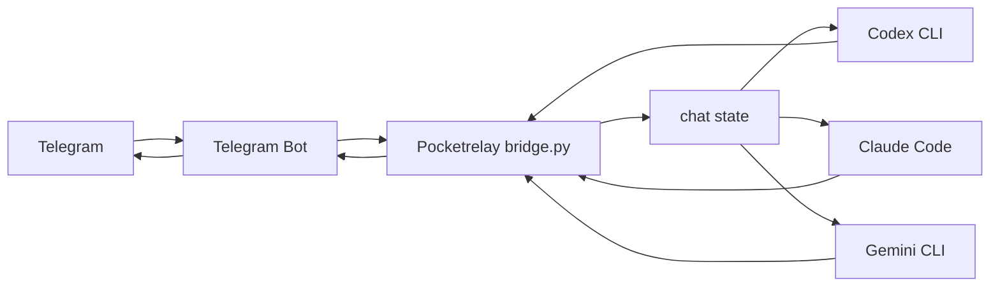

# Pocketrelay

[日本語版はこちら](README.ja.md)

Pocketrelay is a lightweight bridge that lets you talk to local AI coding CLIs from Telegram. It reuses the tools and login state that already exist on your own machine, such as Codex CLI, Claude Code, and Gemini CLI.

It is not Raspberry Pi specific. A Raspberry Pi is just one useful always-on host. Pocketrelay is designed for any user-managed machine where Python 3 and your target CLI can run.

## Why It Exists

Pocketrelay is useful because it gives your phone a direct path to your normal development environment.

- Send tasks to local Codex, Claude, or Gemini from Telegram
- Reuse local repositories, shell environment, config files, and authenticated CLIs
- Keep small investigations, edits, and Git tasks moving while away from your desk
- Avoid building a separate API service just to reach your own machine
- Switch providers from chat when one tool is a better fit or hits a limit
- Resume Codex sessions so follow-up work can continue naturally

## What It Does

- Receives Telegram Bot messages
- Responds only to one allowed Telegram username
- Switches between `codex`, `claude`, and `gemini`
- Stores and resumes Codex CLI sessions
- Queues likely Codex approval failures for one-time retry from Telegram
- Sends start, still-running, and stdout-derived progress updates while a CLI is running
- Supports custom command templates for other local CLIs

## How It Works

Pocketrelay does not call OpenAI, Anthropic, or Google APIs directly. It receives a Telegram message, runs a CLI installed on the same machine as a subprocess, and sends the result back to Telegram.


```mermaid
flowchart LR
    U[Telegram] --> B[Telegram Bot]
    B --> P[Pocketrelay bridge.py]
    P --> S[chat state]
    S --> C1[Codex CLI]
    S --> C2[Claude Code]
    S --> C3[Gemini CLI]
    C1 --> P
    C2 --> P
    C3 --> P
    P --> B
    B --> U
```

## Providers

| provider | Command style | Response source |
| --- | --- | --- |
| `codex` | `codex exec ...` | output file passed with `-o` |
| `claude` | `claude -p ... --output-format text` | stdout |
| `gemini` | `gemini -p ... --output-format json` | `response` in JSON stdout |

The default `provider` is configured in `config.json`. You can switch per chat with commands such as `/provider codex`.

## Setup

1. Create a Telegram bot with BotFather and copy the bot token.
2. Put this repository on the machine you want to keep running.
3. Install and authenticate your target CLI on that machine, for example Codex CLI, Claude Code, or Gemini CLI.
4. Create a local config file.

```bash
cp config.example.json config.json
```

5. Edit `telegram_bot_token`, `allowed_username`, `provider`, `model`, and `workdir` in `config.json`.
6. Run once to check that updates can be received and handled.

```bash
python3 bridge.py --once
```

7. Run continuously.

```bash
python3 bridge.py
```

## Configuration

```json
{
  "telegram_bot_token": "REPLACE_WITH_BOT_TOKEN",
  "allowed_username": "@your_username",
  "provider": "codex",
  "model": "gpt-5.4",
  "cli_command_template": [
    "/home/your_user/.nvm/versions/node/v24.15.0/bin/codex",
    "exec",
    "--skip-git-repo-check",
    "-C",
    "{workdir}",
    "-m",
    "{model}",
    "-o",
    "{output_path}",
    "{prompt}"
  ],
  "workdir": "/home/your_user",
  "codex_sessions": true,
  "codex_approval_mode": "queue",
  "telegram_timeout_seconds": 25,
  "cli_timeout_seconds": 600,
  "processing_message": "受け付けました。処理中です。",
  "progress_updates": true,
  "progress_interval_seconds": 30,
  "progress_output_interval_seconds": 15,
  "progress_line_max_chars": 240,
  "system_prompt": "You are Codex, a pragmatic coding assistant running through a Telegram bridge.\nKeep answers concise and actionable."
}
```

Important keys:

- `telegram_bot_token`: Telegram Bot token
- `allowed_username`: Telegram username allowed to use the bot
- `provider`: default provider, one of `codex`, `claude`, or `gemini`
- `model`: model name passed to the selected CLI
- `workdir`: working directory used when launching the CLI
- `codex_sessions`: whether to store and resume Codex CLI sessions
- `codex_approval_mode`: Codex execution mode: `queue`, `safe`, `read-only`, `full-auto`, or `dangerous`
- `cli_timeout_seconds`: timeout for each CLI run
- `processing_message`: acknowledgement sent before launching the CLI
- `progress_updates`: whether runtime progress updates are sent to Telegram
- `progress_interval_seconds`: still-running update interval when stdout is quiet
- `progress_output_interval_seconds`: minimum interval for stdout-derived progress updates
- `progress_line_max_chars`: maximum length of a stdout line forwarded as progress
- `system_prompt`: system instruction attached to the initial prompt
- `env`: extra environment variables for the CLI process
- `cli_command_template`: command template override for the provider
- `cli_response_mode`: response reader: `output_file`, `stdout`, or `json_stdout`
- `cli_response_key`: JSON key used when `cli_response_mode` is `json_stdout`

Available placeholders in `cli_command_template`:

- `{prompt}`
- `{model}`
- `{workdir}`
- `{output_path}`

## Telegram Commands

### Basics

- `/start`: connection check
- `/help`: show available commands
- `/status`: show provider, CLI readiness, workdir, progress settings, and related state
- `/reset`: clear conversation history and saved sessions

### Provider Switching

- `/provider`: show the current provider and available providers
- `/provider codex`: switch this chat to Codex
- `/provider claude`: switch this chat to Claude
- `/provider gemini`: switch this chat to Gemini
- `/provider reset`: return this chat to the default provider in `config.json`

### Codex Sessions

- `/session`: show the current session state
- `/session status`: same as `/session`
- `/session new`: clear the saved session for the current provider so the next request starts fresh
- `/session reset`: same as `/session new`

When `codex_sessions` is `true`, Pocketrelay stores the Codex CLI session id in `state.json` and uses `codex exec resume` for later requests.

### Codex Approval Modes

- `/approval`: show the current approval mode and pending queue
- `/approval queue`: run with safe defaults and queue likely approval failures
- `/approval safe`: run without additional approval flags
- `/approval read-only`: run with read-only sandboxing
- `/approval full-auto`: run with `--full-auto`
- `/approval dangerous`: bypass approvals and sandboxing
- `/approval reset`: return to the default configured mode
- `/approve <approval_id> full-auto`: retry a queued request once with `full-auto`
- `/approve <approval_id> dangerous`: retry a queued request once with `dangerous`
- `/deny <approval_id>`: cancel a queued request

`dangerous` can significantly affect the local machine. Prefer using it only for a specific queued retry.

## Progress Updates

For normal messages, Pocketrelay first sends `processing_message`. It then reports that the CLI has started, forwards throttled stdout snippets, and sends still-running updates when the CLI is quiet.

Example:

```text
受け付けました。処理中です。
Codex CLI を起動しました。処理を開始しています。
進捗: ...
処理継続中です。経過 30 秒。
```

If this is too noisy, set `progress_updates` to `false` or increase `progress_interval_seconds` and `progress_output_interval_seconds`.

## systemd User Service

To keep Pocketrelay running, edit `systemd/pocketrelay.service` for your local paths and install it as a user service.

```bash
mkdir -p ~/.config/systemd/user
cp systemd/pocketrelay.service ~/.config/systemd/user/
systemctl --user daemon-reload
systemctl --user enable --now pocketrelay.service
```

Check status:

```bash
systemctl --user status pocketrelay.service
```

If your CLIs are installed through nvm, make sure the service `PATH` includes the Node.js `bin` directory that contains `codex`, `claude`, or `gemini`. Add an explicit `Environment=PATH=...` line to the service file.

## Local Files

- `config.json`: local config. It contains the bot token and should not be committed
- `state.json`: update id, chat settings, Codex session ids, and approval queue
- `bridge.log`: runtime log
- `.last_message_*.txt`: temporary CLI output files, normally deleted after each run

## Security Notes

- Do not publish `config.json` or your Telegram Bot token
- `allowed_username` is simple access control, not a hardened multi-user auth system
- Pocketrelay is intended for personal use on a user-managed machine
- `dangerous` mode can affect local files and command execution
- Avoid adding the bot to groups with other users

## Troubleshooting

### Telegram does not respond

- Run `python3 bridge.py --once` and check for exceptions
- Verify the bot token
- Verify `allowed_username`
- Make sure another process is not using `getUpdates` with the same bot token

### CLI is missing

- Check `cli_binary` and `cli_readiness` in `/status`
- Check the service `PATH` if running under systemd
- If using nvm, ensure the CLI is installed in the fixed Node.js version used by the service

### A request gets stuck or fails

- Check `/approval status`
- Retry a queued request with `/approve <id> full-auto` if appropriate
- Confirm `cli_timeout_seconds` is long enough for the task

